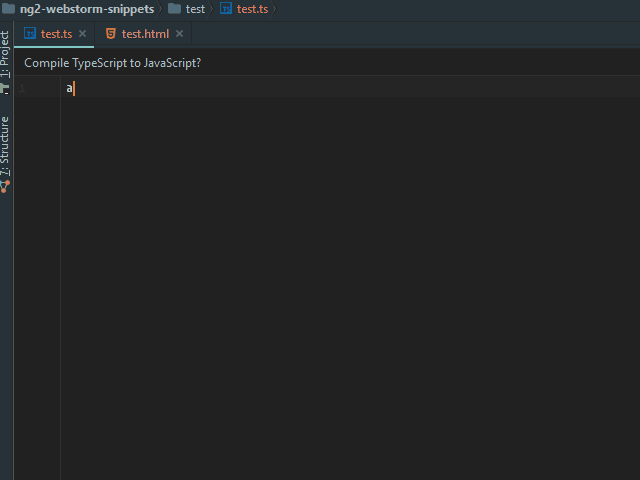
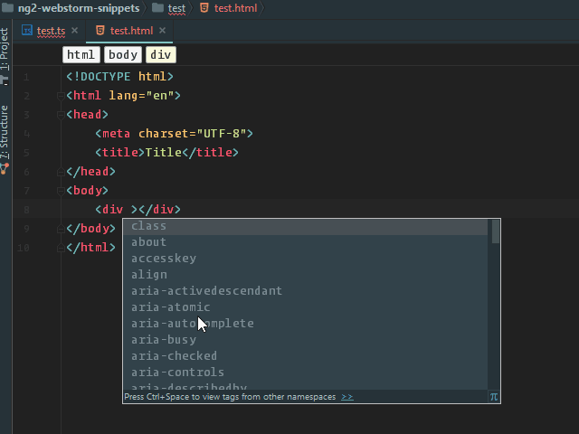

# Angular 2 TypeScript Live Templates (Snippets) for WebStorm

This script convert Angular 2 for TypeScript and HTML snippets from Visual Studio Code 
(Written by [John Papa](https://github.com/johnpapa/vscode-angular2-snippets)) to WebStorm Live Templates.



## Installing the templates

### From JetBrains Plugin repository

- Open IDE preferences `Cmd + ,`
- Go to `Plugins -> Browse repositories`
- Type `angular` and install `Angular 2 TypeScript Templates`
- Restart WebStorm


### By Copy xml file

- Clone repo or download [ng2-templates.xml](https://github.com/MrZaYaC/ng2-webstorm-snippets/blob/master/dist/ng2-templates.xml)
- Place the XML file in your [templates folder](https://www.jetbrains.com/webstorm/help/project-and-ide-settings.html)
: On OSX that would be ~/Library/Preferences/WebStorm{Version}/templates

- Restart WebStorm

## Usage

Type part of a snippet, press `enter`, and the snippet unfolds.

### TypeScript Snippets
```typescript
a-bootstrap       // Angular bootstrapping, for main.ts
a-component       // Angular component
a-component-root  // Angular root app component
a-http-get        // Angular http.get with Rx Observable
a-module          // Angular module
a-module-root     // Angular root app module
a-pipe            // Angular pipe
a-routing         // Angular routing
a-service         // Angular service
a-subscribe       // Angular Rx Observable subscription
```

###HTML Snippets
```html
a-ngClass
a-ngFor
a-ngIf
a-ngModel
a-routerLink
a-ngStyle
a-ngSwitch
a-prej
a-preja
```

